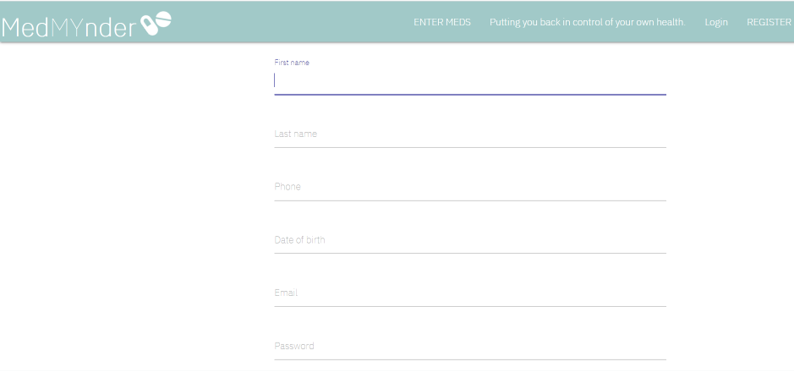

# MedMYnder

This app is still currently being developed. We have deployed the MVP to heroku and you can view it on the following link:

https://medmynder.herokuapp.com

 If you just want to see a video walkthrough of how it works: 


Or, if you like, you can clone it to your machine and view it using the steps below.

## Starting the app locally

Please note that the most complete branch to work with at the moment of writing is called "april19". Please checkout this branch in order to proceed with these steps.

First make sure you have 
```
mongod 

running in a separate terminal.

Then install front and backend dependencies in the client directory.
```
cd client
yarn install


Then go back to the root directory 
```
cd ..
```
and run 
```
yarn install
```
 
After both installations complete, and mongo is running, run the following command in your terminal:

```
yarn start
```

That's it, our app should be running on <http://localhost:3000>. The Express server should intercept any AJAX requests from the client.
 

